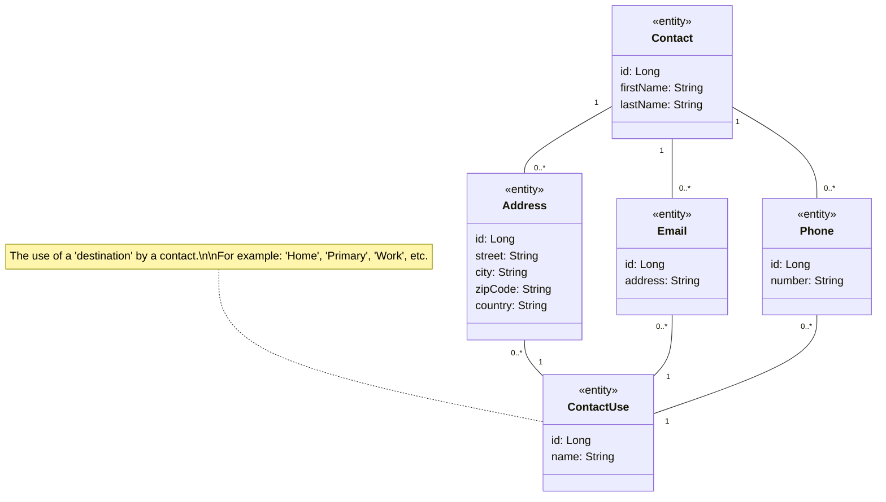

# My Modern Application (2023)

A sample application for demonstrating the techniques and tools I currently use in developing an application.

## Application context

The context of the application is not much important. It is a simple application for managing a set of personal contacts. The application is composed of a REST API and a web frontend application.

## The data model

The data model of the application is described in the following diagram.

## Project modularization

At present the project is composend by a parent Maven project and two modules: `data` and `api`.

The `data` module contains the data model and the JPA-based persistence layer.

The `api` module contains the REST API.

In the future will be added another module for the frontend application (Angular and/or React).

## References

Some documentation, blog articles, StackOverflow questions, code repositories, etc. I consulted for finding solutions to the problems I met in writing this application.

A present not in a particular order.

* [Integration Testing of Spring MVC Applications: Write Clean Assertions with JsonPath](<https://www.petrikainulainen.net/programming/spring-framework/integration-testing-of-spring-mvc-applications-write-clean-assertions-with-jsonpath/>)
* [Using @JsonComponent in Spring Boot](<https://www.baeldung.com/spring-boot-jsoncomponent>)
* (code) [springdoc-openapi converters](https://github.com/springdoc/springdoc-openapi/tree/master/springdoc-openapi-common/src/main/java/org/springdoc/core/converters)
* (video) [Spring Boot @JsonTest Annotation: How to write better JSON tests in Spring](<https://youtu.be/AiiprfLqriY>)
* (issue) [@JsonTest does not load ApplicaitonContext correctly](<https://github.com/spring-projects/spring-boot/issues/5776>)
* [Testing JSON Serialization With @JsonTest and Spring Boot](<https://rieckpil.de/testing-your-json-serialization-with-jsontest/>)
* [Testing Serialization With Spring Boot @JsonTest](<https://www.arhohuttunen.com/spring-boot-jsontest/>)
* [Spring Boot Testing features](<https://docs.spring.io/spring-boot/docs/current/reference/html/features.html#features.testing>)
* [Spring Boot Testing — Testcontainers and Flyway](<https://dev.to/kirekov/spring-boot-testing-testcontainers-and-flyway-2jpd>)
* [Fast, Reliable Integration Tests with Spring Boot and Flyway](<https://aahlenst.dev/blog/fast-reliable-integration-tests-with-spring/>)
* [Spring Boot & Flyway - clear database between integration tests](<https://maciejwalkowiak.com/blog/spring-boot-flyway-clear-database-integration-tests/>)
* [Guide to using attached tests](<https://maven.apache.org/guides/mini/guide-attached-tests.html>)
* [Flyway Database Schema Migrations](<https://vladmihalcea.com/flyway-database-schema-migrations/>)
